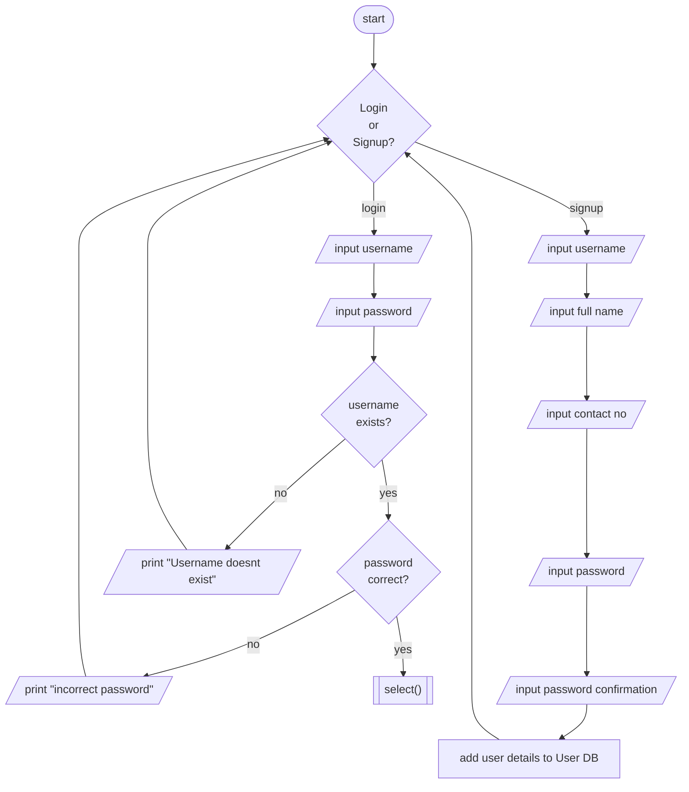
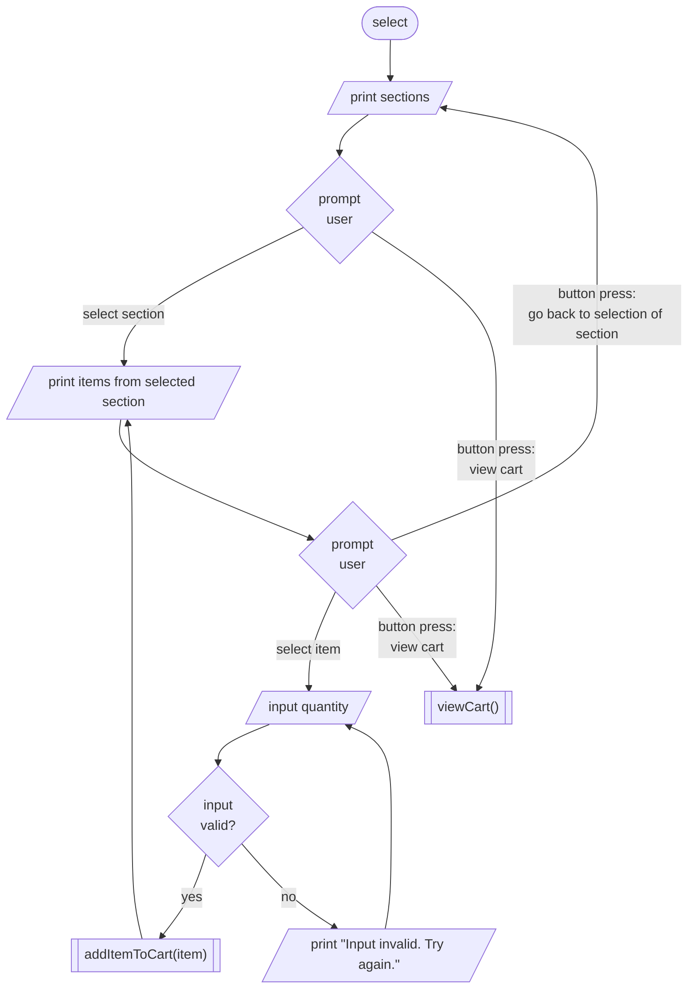
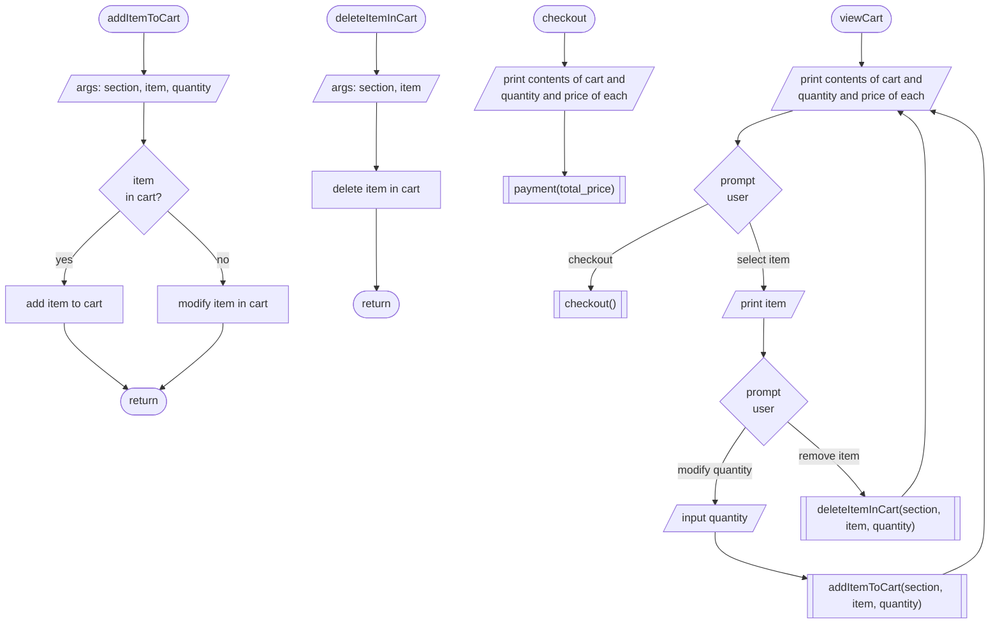
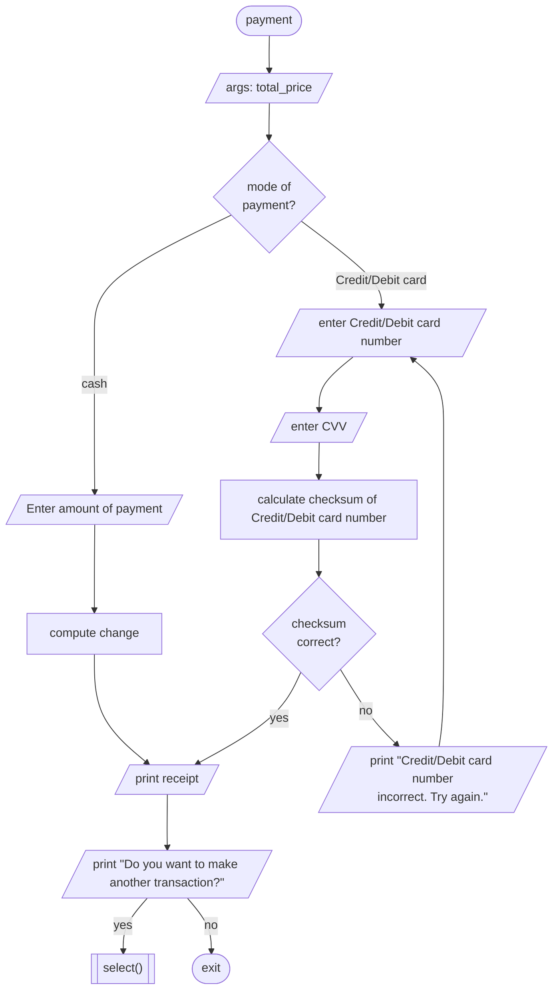

## Run

```sh
just run
```

## Flowchart


```mermaid
flowchart TD
    start([start]) --> A
    A{Login<br>or<br>Signup?}
        A --> |login| B[/input username/]
        B --> F[/input password/]
        F --> C{username<br>exists?}
                D --> |no| H[/print "incorrect password"/] --> A
            C --> |no| G[/print "Username doesnt exist"/] --> A
            C --> |yes| D{password<br>correct?}
                D --> |yes| E[["select()"]]
        A --> |signup| I[/input username/] -->
        J[/input full name/] -->
        K[/input contact no/] -->
        L[/input password/] -->
        M[/input password confirmation/] -->
        N[add user details to User DB] --> A
```


```mermaid
flowchart TD
    start([select]) -->
    A[/print sections/] -->
    B{prompt<br>user} --> |select section| C[/print items from selected section/] -->
    D{prompt<br>user}
        D --> |button press:<br>go back to selection of section| A
        D --> |select item| E[/input quantity/]
            E --> F{input<br>valid?}
                G --> E
                F --> |yes| H[["addItemToCart(item)"]] --> C
                F --> |no| G[/print "Input invalid. Try again."/]
    B & D --> |button press:<br>view cart| K[["viewCart()"]]
```


```mermaid
flowchart TD
    addItemToCart([addItemToCart]) -->
    A[/args: section, item, quantity/] -->
    K{item<br>in cart?}
        K --> |yes| B[add item to cart] --> C
        K --> |no| L[modify item in cart] --> C
    C([return])

    deleteItemInCart([deleteItemInCart]) -->
    M[/args: section, item/] -->
    N[delete item in cart] -->
    O([return])

    checkout([checkout]) -->
    Q[/print contents of cart and<br>quantity and price of each/] -->
    R[["payment(total_price)"]]

    viewCart([viewCart]) -->
    D[/print contents of cart and<br>quantity and price of each/] -->
    E{prompt<br>user}
        E --> |checkout| F[["checkout()"]]
        E --> |select item| G[/print item/] -->
            H{prompt<br>user}
                H --> |modify quantity| I[/input quantity/] -->
                    J[["addItemToCart(section, item, quantity)"]] --> D
                H --> |remove item| P[["deleteItemInCart(section, item, quantity)"]] --> D
```


```mermaid
flowchart TD
    checkout([payment]) -->
    AD[/args: total_price/] -->
    R{mode of<br>payment?}
        R --> |cash| S[/Enter amount of payment/] -->
            T[compute change] -->
            U[/print receipt/] -->
            AA[/print "Do you want to make another transaction?"/]
                AA --> |yes| AB[["select()"]]
                AA --> |no| AC([exit])
        R --> |Credit/Debit card| V[/enter Credit/Debit card number/] -->
            W[/enter CVV/] -->
            X[calculate checksum of Credit/Debit card number] -->
            Y{checksum<br>correct?}
                Y --> |yes| U
                Y --> |no| Z[/print "Credit/Debit card number<br>incorrect. Try again."/] --> V
```